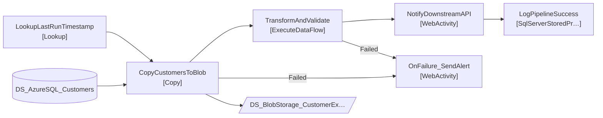

# Pipeline_CustomerSync

## Architecture Overview

---

# ETL Pipeline Documentation

## Purpose
The `Pipeline_CustomerSync` job is designed to synchronize customer data from an Azure SQL Database to Azure Blob Storage. Additionally, it notifies downstream systems through a REST API. The pipeline is configured with parameters such as environment and batch size to control its execution.

## Data Flow
The components of the pipeline are executed in the following order, based on their dependencies:
1. **LookupLastRunTimestamp**
   - Retrieves the last run timestamp from the pipeline log.
2. **CopyCustomersToBlob**
   - Copies updated customer data from the Azure SQL Database to Azure Blob Storage.
3. **TransformAndValidate**
   - Executes transformations and validation on the copied customer data.
4. **NotifyDownstreamAPI**
   - Sends a notification to the downstream API after successful data transformation.
5. **LogPipelineSuccess**
   - Logs the successful completion of the pipeline run.
6. **OnFailure_SendAlert**
   - Sends an alert to a designated communication channel (e.g., Slack) if an earlier component fails.

## Source Systems
- **Dataset**: `DS_AzureSQL_Customers`
- **Linked Service**: Azure SQL Database (used in the Lookup and Copy components)

## Target Systems
- **Dataset**: `DS_BlobStorage_CustomerExport`
- **Linked Service**: Azure Blob Storage (used in Copy component)

## Transformations
- **Lookup**:
  - **LookupLastRunTimestamp**: Retrieves the last run timestamp for the pipeline.
  
- **Copy**:
  - **CopyCustomersToBlob**: Copies relevant customer fields (`id`, `first_name`, `last_name`, `email`, `phone`, `country_code`, `segment`, `updated_at`) from the Azure SQL Database into Azure Blob Storage.

- **ExecuteDataFlow**:
  - **TransformAndValidate**: Executes a data flow that transforms and validates the copied customer data.

- **WebActivity**:
  - **NotifyDownstreamAPI**: Notifies the downstream API of the data sync completion.
  - **OnFailure_SendAlert**: Sends an alert via Slack on failure.

## Data Lineage
The lineage of data flow through the pipeline is as follows:
- **LookupLastRunTimestamp**:
  - Fetches last run timestamp from `etl_control.pipeline_log`.

- **CopyCustomersToBlob**:
  - Sources data based on the fetched timestamp, specifically from `dbo.customers` in Azure SQL.

- **TransformAndValidate**:
  - Processes the data copied to Azure Blob Storage.

- **NotifyDownstreamAPI**:
  - Sends a notification based on the transformed data.

- **LogPipelineSuccess**:
  - Logs the entire run if successful.

## Impact Analysis
Here's a breakdown of the key fields/tables and their impact:

- **Last Run Timestamp** (`etl_control.pipeline_log`) 
  - Activities affected: LookupLastRunTimestamp, CopyCustomersToBlob
  - Risk: Medium

- **Customer Data** (`dbo.customers`)
  - Activities affected: CopyCustomersToBlob
  - Risk: High

- **Pipeline Log** (`[etl_control].[usp_LogPipelineRun]`)
  - Activities affected: LogPipelineSuccess
  - Risk: Low

## Risks
- **Hardcoded Values**: There are endpoints within API calls that utilize hardcoded values.
- **Missing Retry Policies**: Not specified for all components, particularly critical actions should have retries defined.
- **External Dependencies**: Successful execution of notifications relies on external systems' availability.
- **Activities Without `dependsOn`**: Legal enforcement of order of operations is established, however monitoring of failure paths needs attention.

## Operations & Error Handling
Monitoring should focus on the success of each component in order of execution. Key aspects include:
- **Success Notifications**: Successful endpoint responses and logging.
- **Error Handling**: The pipeline utilizes the `OnFailure_SendAlert` component to notify for any failure occurring in **CopyCustomersToBlob** or **TransformAndValidate**.  
  - Monitor the success status of each step and configure alerts to immediately respond to failures.

This detailed analysis allows for effective monitoring, management, and evolution of the data pipeline, ensuring smooth operation in synchronizing customer data.
